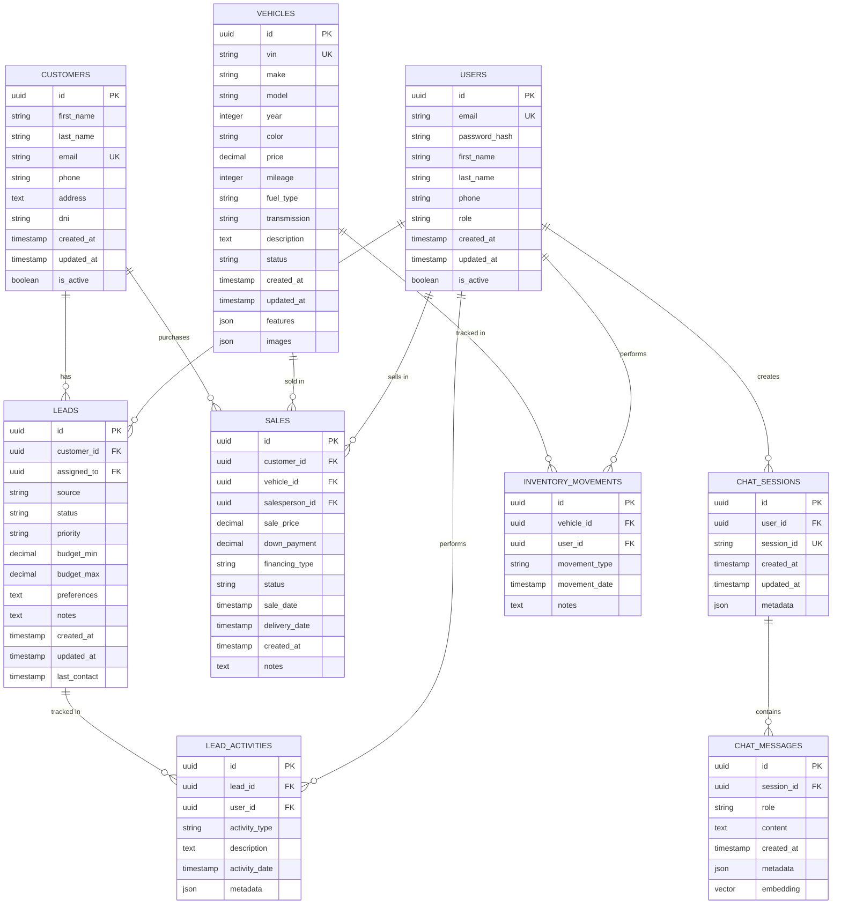

# Modelo de Datos del Sistema de Gestión de Concesionario

```mermaid

erDiagram
    USERS {
        uuid id PK
        string email UK
        string password_hash
        string first_name
        string last_name
        string phone
        string role
        timestamp created_at
        timestamp updated_at
        boolean is_active
    }

    CUSTOMERS {
        uuid id PK
        string first_name
        string last_name
        string email UK
        string phone
        text address
        string dni
        timestamp created_at
        timestamp updated_at
        boolean is_active
    }

    VEHICLES {
        uuid id PK
        string vin UK
        string make
        string model
        integer year
        string color
        decimal price
        integer mileage
        string fuel_type
        string transmission
        text description
        string status
        timestamp created_at
        timestamp updated_at
        json features
        json images
    }

    LEADS {
        uuid id PK
        uuid customer_id FK
        uuid assigned_to FK
        string source
        string status
        string priority
        decimal budget_min
        decimal budget_max
        text preferences
        text notes
        timestamp created_at
        timestamp updated_at
        timestamp last_contact
    }

    SALES {
        uuid id PK
        uuid customer_id FK
        uuid vehicle_id FK
        uuid salesperson_id FK
        decimal sale_price
        decimal down_payment
        string financing_type
        string status
        timestamp sale_date
        timestamp delivery_date
        timestamp created_at
        text notes
    }

    CHAT_SESSIONS {
        uuid id PK
        uuid user_id FK
        string session_id UK
        timestamp created_at
        timestamp updated_at
        json metadata
    }

    CHAT_MESSAGES {
        uuid id PK
        uuid session_id FK
        string role
        text content
        timestamp created_at
        json metadata
        vector embedding
    }

    INVENTORY_MOVEMENTS {
        uuid id PK
        uuid vehicle_id FK
        uuid user_id FK
        string movement_type
        timestamp movement_date
        text notes
    }

    LEAD_ACTIVITIES {
        uuid id PK
        uuid lead_id FK
        uuid user_id FK
        string activity_type
        text description
        timestamp activity_date
        json metadata
    }

    CUSTOMERS ||--o{ LEADS : has
    USERS ||--o{ LEADS : "assigned to"
    CUSTOMERS ||--o{ SALES : purchases
    VEHICLES ||--o{ SALES : "sold in"
    USERS ||--o{ SALES : "sells in"
    USERS ||--o{ CHAT_SESSIONS : creates
    CHAT_SESSIONS ||--o{ CHAT_MESSAGES : contains
    VEHICLES ||--o{ INVENTORY_MOVEMENTS : "tracked in"
    USERS ||--o{ INVENTORY_MOVEMENTS : performs
    LEADS ||--o{ LEAD_ACTIVITIES : "tracked in"
    USERS ||--o{ LEAD_ACTIVITIES : performs

```
